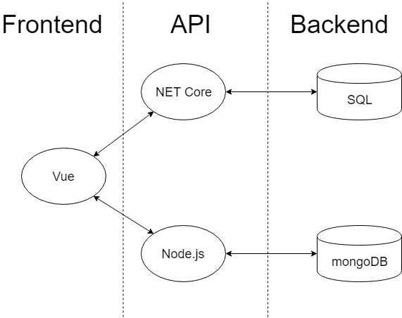

# TC3041 Proyecto Final Primavera 2019

# *chasIT - Chas y lo tienes!*
---

##### Integrantes:
1. Salomon Charabati
2. Mauricio Coello
3. Eric Parton

---
## 1. Descripción del proyecto

**chasIT** es una solución que une a personas que necesitan realizar trabajos, y a personas que los pueden realizar.  Usuarios que requieren que se haga un trabajo, por ejemplo pintar una casa en la CDMX, pueden hacer una petición que le llega a todos los trabajadores relevantes registrados en la zona, en este ejemplo son los pintores en la CDMX nada más, y los trabajadores pueden aceptar el trabajo si están de acuerdo con las condiciones.

## 2. Solución

### 2.1 Modelos de bases de datos utilizados
#### MongoDB
Usamos MongoDB porque la compatibilidad que ofrece fue ideal para cumplir los objetivos del proyecto.  Poder comunicar los datos en formato JSON dentro de la aplicación fue muy conveniente y fue fácil de encontrar documentación.  Lo usamos para el almacenamiento de los usuarios usando documentos con el siguiente formato:
```sh
  "_id": "5ccb587c7bc7b000113c8f6e",
  "firstName": "Juan",
  "lastName": "Gomez",
  "email": "juan.gomez@gmail.com.com",
  "title": "International Plumber",
  "profileImageUrl": "https://s3.amazonaws.com/uifaces/faces/juangomez/128.jpg",
  "role": "5ccb587a7bc7b000113c8f51",
  "isActive": true,
  "roleName": "Admin",
  "roleRank": 1,
  "createdAt": "2019-04-20T20:52:12.150Z",
  "isEnabled": true,
  "passwordUpdateRequired": false,
  "pinUpdateRequired": false,
  "isDeleted": false
```
#### SQL
Escogimos usar SQL con Microsoft Azure porque los tipos que estamos manejando son muy fijos y no requieren de una estructura más complicada que una tabla.  También como sólo maneja tablas pequeñas (categoría, sub-categoría, servicios, etc.), no se espera que tenga que manejar cantidades grandes de datos (como los usuarios registrados por ejemplo).  Por ejemplo, guardamos las categorías con el siguiente formato (definido en C#):
```sh
namespace YeloMWS.Models.Category
{
    public class YeloCategory
    {
        public long Id { get; set; }
        public string Title { get; set; }
        public virtual YeloCategory ParentCategory { get; set; }
        public string CodeName { get; set; }
        public string IconResource { get; set; }
    }
}
```

### 2.2 Arquitectura de la solución

Hicimos un frontend con Vue que se comunica a través de NET Core para la base de datos SQL y a través de Node.js para la base de datos de mongoDB, cada parte dentro su propio contenedor en Docker.
#


### 2.3 Frontend

El frontend utiliza el framework de Vue.js.  Permite reusar código a través de templates y facilita la inserción de datos desde documentos de JSON.

#### 2.3.1 Lenguaje de programación
El frontend está programado en JavaScript.  Hay código en HTML/CSS (no lenguajes de programación pero cabe mencionar).
#### 2.3.2 Framework
| Framework | Utilidad |
| ------ | ------ |
| Vue.js | Facilita la creación de interfaces, especialmente en sitios de una sola página. |


#### 2.3.3 Librerías de funciones o dependencias
| Dependencia | Utilidad |
| ------ | ------ |
| axios | Promise-based HTTP client de node.js |
| babel-runtime | Convertidor de ECMAScript |
| change-case | Cambiar el case de caracteres |
| chart.js | Para hacer gráficas |
| datables.net | JQuery plugin para manejar llamadas de JSON |
| faker | Para generar datos |
| hideseek | JQuery plugin para hace búsquedas  |
| http-server | Servidor de http |
| jquery | JavaScript utility library |
| lodash | JavaScript utility library |
| moment | Libreria para manejar fechas |
| nes | Websockets que trabajan sobre hapi |
| querystring | Para procesar URLs |
| sweetalert2 | Para hacer alertas en JavaScript de forma bonita |
| v-tooltip | On hover tool tips |
| validator | Validator/sanitiser de strings |
| vue | Framework para crear interfaces |
| vuex | Manejo de estados de Vue |

### 2.4 Backend
El backend, igual que los APIs, se divide en dos.
Tenemos MongoDB en un lado del backend, comunicando con el frontend por Node.js directamente.
Mientras, la base de SQL está en Microsoft Azure.

#### 2.4.1 Lenguaje de programación
Con MongoDB utilizamos JavaScript (por estar usando Node.js) y con SQL utilizamos C# (por estar usando .NET Core y porque es nativo).
#### 2.4.2 Framework
| Framework | Utilidad |
| ------ | ------ |
| Node.js | Server environment entre muchas otras cosas |
| .NET Core | Server environment entre muchas otras cosas |
#### 2.4.3 Librerías de funciones o dependencias
| Dependencia | Utilidad |
| ------ | ------ |
| aws-sdk | Librería para usar AWS y Node.js |
| bcryptjs | Función de hasheo |
| bell | Plugin para third-party login |
| boom | Cambia los errores de HTTP para que sean más entendibles |
| chalk | Formateo de texto |
| dotenv | Para guardar cookies |
| faker | Generar datos |
| glue | Permite configurar hapi con JSONs |
| handlebars | Templating usando {{corchetes}} |
| hapi-auth-jwt2 | Autenticación con hapi |
| imagemagick | Para editar imagenes |
| iplocation | Saca una ubicación con un IP |
| joi | Validación de información con third parties |
| jsonwebtoken | Implementación de tokens |
| lodash | JavaScript utility library |
| mongoose | Facilita usar MongoDB |
| nes | Websockets que trabajan sobre hapi |
|node-uuid | Generador de IDs para usuarios |
| nodemailer | Mandar correos desde node |
| owasp-password-strength-test | Prueba la fuerza de una contraseña |
| password-generator | Generador de contraseñas |
| q | Libreria para implementar promesas |
| request-promise | Libreria para implementar promesas |
| require-dir | Libreria para trabajar con directorios extensos |
| rest-hapi | Generador de RESTful APIs |
| zxcvbn | Prueba la fuerza de una contraseña |

### 2.5 API

Usamos dos soluciones para la implementación el API.  
Primero, para la conexión a la base de datos de MongoDB usamos Node.js.  La decisión fue sencilla por varias razones:
- Hay un driver oficial de Node.js para MongoDB.
- Node.js utiliza JavaScript que facilita muchos temas cuando se desarrolla en Internet.
- Hay documentación amplia que describe la interacción con MongoDBy con Vue. 

.NET Core fue utilizado porque es el framework con mayor compatibilidad con bases de datos de SQL en Azure y, otra vez, tiene una gran cantidad de documentación clara.

#### 2.5.1 Lenguaje de programación
Node.js, como su nombre implica, funciona con JavaScript.  Con .NET Core, las definiciones de nuestras clases y los métodos están en C#.
#### 2.5.2 Framework
| Framework | Utilidad |
| ------ | ------ |
| Node.js | Server environment entre muchas otras cosas |
| .NET Core | Server environment entre muchas otras cosas |
#### 2.5.3 Librerías de funciones o dependencias

* **Descripción**: Recibir detalles de cierta categoría
* **URL**: api/YeloCategories
* **Verbos HTTP**: GET
* **Headers**: authorization, content-type
* **Formato JSON del cuerpo de la solicitud**:
{   Id: integer,
Title: string,
ParentCategory: YeloCategorry,
CodeName: string,
IconResource: string }
* **Formato JSON de la respuesta**: 
{ CodeName: string,
IconResource: string,
Id: integer,
ParentCategor: string,
Title: string}

#
* **Descripción**: Recibir detalles de cierta categoría
* **URL**: api/postYeloCategories
* **Verbos HTTP**: POST
* **Headers**: authorization, content-type
* **Formato JSON del cuerpo de la solicitud**:
{   DateTime: datetime,
Description: string,
RequestedDateTimeStart: datetime,
Latitude: float,
Longitude: float,
YeloCategory: integer,
ServiceType: integer}
* **Formato JSON de la respuesta**:
{ DateTime: datetime,
Description: string,
Id: integer,
RequestedDateTimeEnd: datetime,
RequestedDateTimeStart: datetime,
ServiceType: integer,
YeloCategory: integer,
YeloSP: integer,
YeloUser: object
}

#
* **Descripción**: Recibir detalles de cierta categoría
* **URL**: api/GetCards
* **Verbos HTTP**: POST
* **Headers**: authorization, content-type

#
* **Descripción**: Recibir detalles de cierta categoría
* **URL**: api/GetUserServices
* **Verbos HTTP**: POST
* **Headers**: authorization, content-type

#
* **Descripción**: Recibir detalles de cierta categoría
* **URL**: api/PostCategoria
* **Verbos HTTP**: POST
* **Headers**: authorization, content-type

## 3. Pasos a seguir para utilizar el proyecto
- Clone el repositorio.
```sh
$ git clone https://github.com/salochara/PF-equipo-1/
```
- Haga docker-compose desde el directorio del proyecto para crear y conectar los contenedores.  Este paso sólo se tiene que hacer una vez.
```sh
$ docker-compose build && docker-compose run --rm api npm run seed
```
- Haga docker-compose up cada vez que quiera correr el proyecto para levantar los contenedores de nuevo.
```sh
$ docker-compose up --build
```
- El programa se puede visualizar en localhost:3000

## 4. Datasets
Todos los datos (fuera de las categorías que son pocas) han salido de pruebas reales de una app que Mauricio está desarrollando.  La mayoría de los datos son de usuarios reales que se registraron en pruebas y eventos. 

## 5. Referencias
- http://generatedata.com/ - Generador de datos
- https://www.json-generator.com/ - Generador de datos
- https://docs.mongodb.com/manual/reference/ - Documentación de Mongo
- https://docs.microsoft.com/en-us/azure/sql-database/ - Documentación de Azure SQL
- https://github.com/JKHeadley/appy - Template de dashboard
- https://azure.microsoft.com/en-us/services/kubernetes-service/docker/ - Información sobre Azure y cómo conectarlo con Docker
- https://scotch.io/tutorials/building-a-modern-app-using-nestjs-mongodb-and-vuejs - Tutorial, varios
- https://vuejs.org/v2/guide/ - Tutorial para usar Vue
- https://aspnetcore.readthedocs.io/en/stable/tutorials/publish-to-azure-webapp-using-vs.html - Tutorial de NET Core
